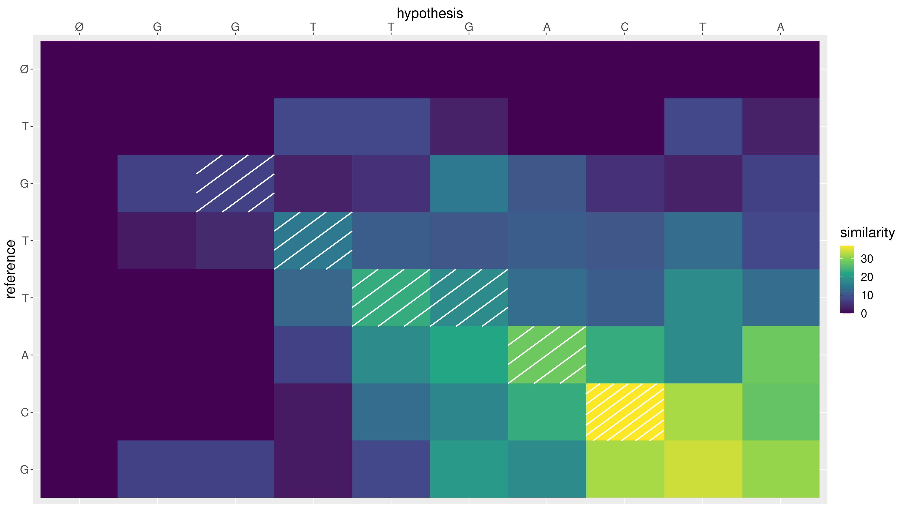

# Лабораторная работа №2 (Исправление опечаток)

## Синопсис лекции

**Расстояние Левенштайна** - метрика, позволяющая оценить разность двух строк путем их посимвольного сравнения.  
**Алгоритм Вагнера-Фишера** - базовый алгоритм, реализующий подсчет расстояния Левенштайна путем вычисления матрицы расстояний редактирования префиксов заданных последовательностей.  
**Алгоритм Хиршберга** - алгоритм, реализующий подсчет расстояния Левенштайна путем реализации концепции "разделяй и властвуй" (divide and conquer), за счет чего обеспечивается экономичное использование памяти.  

## Задание

1. Необходимо реализовать подсчет расстояния Левенштайна для сравнения двух строк на основе одного из двух алгоритмов, представленных в лекции:
    * **алгоритм Вагнера-Фишера** - без возможности получения дополнительных баллов на защите по данному пункту;
    * **алгоритм Хиршберга** - для возможности получения дополнительных баллов на защите по данному пункту.
1. Требуется сформировать словарь токенов выбранного датасета (по результатам аннотации обучающей выборки, сформированным при выполнении [первой лабораторной работы](/tasks/task-01)) и сохранить его во внешний файл в произвольном формате;
1. На основе реализованного алгоритма реализовать модуль исправления опечаток с использованием словаря, сформированного на предыдущем шаге. При реализации модуля исправления опечаток рекомендуется также учитывать вероятность замены какого-либо символа на другой. Данная вероятность пропорциональна расстоянию между клавишами на клавиатуре с раскладкой `QWERTY`;
1. Протестировать разработанный модуль на версии тестового датасета, в которую были искусственно внесены опечатки. Указанные версии тестового датасета доступны по [данной ссылке](https://bit.ly/corrupted-corpora), необходимо загрузить один файл, который соответствует выбранному датасету.
1. Убедиться, что в результате работы модуля получается набор данных, содержащий меньшее количество опечаток относительно исходной версии тестовой выборки. Оценить качество работы реализованного модуля следующим образом:
    * подсчитать общее количество токенов в тестовой выборке;
    * подсчитать количество токенов, не содержащих опечаток, до и после работы модуля на искусственно модифицированной версии тестовой выборки;
    * разделить значения, полученные на предыдущем шаге, на общее количество токенов в тестовой выборке (в результате должно получиться два числа в интервале от 0 до 1, разница в которых отражает эффективность работы реализованного модуля).
1. Если наборы данных не идентичны (модуль не позволяет исправить **все** опечатки) - объяснить случаи, в которых опечатки исправить не удалось.
