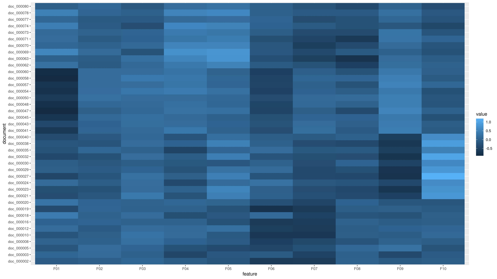

# Лабораторная работа №3 (Векторизация текста)

## Синопсис лекции

**Векторизация** - преобразование текста из символьного представления в последовательность вещественных чисел (векторов) заданного размера.  
**Tf-idf** - метрика, позволяющая оценить важность термина с точки зрения его использования для автоматической обработки некоторого корпуса. Как видно из названия, значение данной метрики прямо пропорционально частоте употребления токена в корпусе (term frequency) и обратно пропорционально количеству фрагментов текста, в которых данный токен употребляется (inverse document frequency).  
**w2v** - метод векторизации текста, основанный на построении предсказательной (generative) модели, обеспечивающей кодирование токенов, встречающихся в одинаковом контексте, близкими значениями векторов.  
**glove** - метод векторизации текста, основанный на построении описательной (discriminative) модели, обучение которой осуществляется на основе матрицы "термин-документ" (term-document matrix).  



## Задание

1. По сформированной в результате выполнения [первой лабораторной работы](/tasks/task-01) аннотации обучающей выборки в формате `tsv` построить словарь токенов с указанием их частот (словарь должен содержать как сами токены, так и количество их упоотреблений в тестовой выборке) и матрицу "термин-документ" (term-document matrix). Результаты необходимо сохранить во внешние файлы в произвольном формате. Использование стандартных библиотечных реализаций данных преобразований не разрешается. Для получения дополнительных баллов здесь и далее требуется убирать из текста стоп-слова и пунктуацию, а также низкочастотные токены. Также для получения дополнительных баллов по данному пункту необходимо учитывать эффективность хранения разреженных структур данных на диске.
1. На выбор реализовать один из базовых методов векторизации произвольного текста (варианты приведены с увеличением сложности реализации):
    - Разработать метод, позволяющий преобразовать произвольный текст в вектор частот токенов, содержащихся в данном тексте, с использованием словаря токенов с указанием их частот, полученного на предыдущем шаге. Предложить и реализовать способ обработки токенов, отсутствующих в словаре (простейший вариант - пропуск таких токенов);
    - Разработать метод, позволяющий преобразовать произвольный текст в единичную матрицу (каждая строка соответствует одному токену входного текста и содержит только одну единицу, остальные ячейки заполнены нулями, каждый столбец соответствует одному токену словаря), с использованием словаря, полученного ранее. Предложить и реализовать способ преобразования полученной матрицы в вектор (наиболее простой вариант - подсчитать среднее значение для каждого столбца матрицы);
    - Разработать метод, позволяющий преобразовать произвольный текст в матрицу частот токенов (каждая строка соответствует одному токену входного текста и содержит только одно ненулевое значение, остальные ячейки заполнены нулями, каждый столбец соответствует одному токену словаря), с использованием словаря наиболее частых слов, полученного ранее. Предложить и реализовать способ преобразования полученной матрицы в вектор (наиболее простой вариант - подсчитать среднее значение для каждого столбца матрицы);
    - Разработать метод, позволяющий преобразовать произвольный текст в вектор значений `tf-idf`, с использованием словаря наиболее частых слов и матрицы "термин-документ", полученных ранее;
    - Разработать метод, позволяющий преобразовать произвольный текст в матрицу частот и матрицу значений `tf-idf` (каждой строке матрицы соответствует одно предложение текста, каждому столбцу - один токен предложения), с использованием словаря наиболее частых слов и матрицы "термин-документ", полученных ранее. Предложить и реализовать решение проблемы неодинакового количества токенов в предложении (наиболее простой вариант - заполнить "лишние" ячейки матрицы нулями). Реализовать способ подсчета векторного представления документа на основе векторных представлений отдельных предложений (наиболее простой вариант - подсчитать среднее значение по строкам матрицы).
1. Реализовать метод, позволяющий векторизовать произвольный текст с использованием нейронных сетей (предлагается использовать стандартную реализацию модели `w2v` или `glove`). Выбранную модель необходимо обучить на обучающей выборке.
1. С использованием библиотечной реализации метода подсчета косинусного расстояния между векторными представлениями текста (для возможности получения дополнительных баллов на защите по данному пункту необходимо реализовать данный метод самостоятельно), продемонстрировать на примерах, что для семантически близких слов модель генерирует вектора, для которых косинусное расстояние меньше, чем для семантически далеких токенов. Для получения дополнительных баллов требуется также выполнить серию экспериментов с гиперпараметрами модели, выбранной на предыдущем шаге, для каждого набора гиперпараметров измерить значение косинусного расстояния для некоторого тестового набора пар семантически близких и семантически далеких токенов, сформулировать вывод о том, какой набор гиперпараметров является оптимальным. Демонстрация работы модели может происходить в соответствии с одним из двух сценариев (сценарии приведены в порядке увеличения сложности реализации):
    - Ручное выделение набора токенов (от 2 до 5) из датасета, для каждого токена определение 2-3 токенов с похожим значением, 2-3 токенов из той же предметной области и 2-3 токенов с совершенно другими семантическими свойствами. Например, если изначально взяли токен `cat`, то токенами с похожим значением могут быть `tiger`, `felines`, токенами из той же предметной области - `animal`, `rabbit`, токенами с соверешенно другими семантическими свойствами - `sentence`, `creation`. Необходимо получить векторное представление для каждого исходного токена, векторные представления токенов из 3 указанных групп и продемонстрировать в виде ранжированного списка с указанием косинусного расстояния, что между векторным представлением исходного токена и токенов с похожим значением косинусное расстояние меньше, чем между векторным представлением исходного токена и токенов из той же предметной области, которое в свою очередь меньше косинусного расстояния между векторным представлением исходного токена и векторными представлениями токенов с совершенно другими семантическими свойствами;
    - Аналогично предыдущему варианту, выделение набора исходных токенов и для каждого исходного токена - нескольких токенов из 3 "групп похожести". Далее для каждого токена требуется сформировать векторное представление, выполнить сокращение его размерности до двумерного вектора с помощью какого-либо метода сокращения размерности (в простейшем случае - `PCA`, допускается использование библиотечной реализации) и построение двумерной точечной диаграммы с полученным результатом. Каждой точке на сформированной диаграмме должна соответствовать текстовая метка, в качестве который выступает строковое представление соответствующего токена. Визуально должна прослеживаться корреляция семантического сходства токенов и расстояния между ними на сформированной диаграмме. Допускается построение и трехмерной диаграммы при условии сохранения наглядности демонстрации работы модели.
1. Применить какой-либо метод сокращения размерностей полученных одним из базовых способов векторизации, выбранным ранее (см. пункт 2), векторов (в простейшем случае можно использовать метод `PCA`, причем допускается использование библиотечной реализации, сокращенная размерность должна быть сопоставима с размерностью векторов, формируемых векторной моделью, примененной на шаге 3, поскольку далее будет предложено сравнить данный метод с подходом, основанным на использовании векторной модели), а именно:
    * кодированием текста в виде последовательности частот токенов;
    * кодированием текста в виде единичной матрицы (здесь также необходимо предложить способ преобразования матрицы в вектор);
    * кодированием текста в виде матрицы частот токенов (здесь также необходимо предложить способ преобразования матрицы в вектор);
    * кодированием текста в виде наборов значений метрики `tf-idf`;
    * кодированием текста в виде наборов значений частот токенов и значений метрики `tf-idf`, с предварительным подсчетом векторых представлений отдельных предложений.
1. С использованием разработанного метода подсчета косинусного расстояния сравнить эффективность метода векторизации с использованием нейронных сетей и эффективность базовых методов векторизации с последующим сокращением размерности. Сформулировать вывод о том, применение какого способа позволяет получить лучшие результаты на выбранном датасете.
1. Реализовать метод, осуществляющий векторизацию произвольного текста по следующему алгоритму:
    * сегментация текста на предложения и токены;
    * формирование векторных представлений каждого токена по-отдельности с использованием выбранной модели векторных представлений текста, основанной на нейронных сетях;
    * подсчет взвешенного среднего векторных представлений токенов каждого предложения, в качестве веса использовать метрику `tf-idf`, подсчитанную по обучающей выборке;
    * подсчет векторного представления документа по векторным представлениям составляющих его предложений в соответствии с некоторым подходом (например, путем подсчета среднего значения).
1. Выполнить векторизацию тестовой выборки с использованием метода, реализованного на предыдущем шаге. Результаты сохранить в формате `tsv` в соответствии со следующей структурой (векторному представлению каждого документа выборки соответствует отдельная строка, в которой сначала записывается идентификатор документа, совпадающий с названием соотвествующего файла без расширения с аннотацией из [первой лабораторной работы](/tasks/task-01), далее должен быть символ `\t`, после которого - вещественные числа, составляющие векторное представление документа и разделенные символом `\t`; векторные представления каждого документа должны иметь одинаковый размер, количество документов должно совпадать с количеством экземпляров тестовой выборки):
```tsv
<doc_id_1>	<embedding_1_component_1>	<embedding_1_component_2>	<embedding_1_component_3>	...	<embedding_1_component_M>
<doc_id_2>	<embedding_2_component_1>	<embedding_2_component_2>	<embedding_2_component_3>	...	<embedding_2_component_M>
...
<doc_id_N>	<embedding_N_component_1>	<embedding_N_component_2>	<embedding_N_component_3>	...	<embedding_N_component_M>
```

Пример фрагмента результирующего файла:
```tsv
001	0.1	0.2	0.9	0.4
002	0.2	0.2	0.5	0.4
```

Результаты выполнения работы необходимо разместить в файле `/projects/<PROJECT_NAME>/assets/annotated-corpus/test-embeddings.tsv` (путь указан относительно корня репозитория, `<PROJECT_NAME>` следует заменить на название проекта).  
