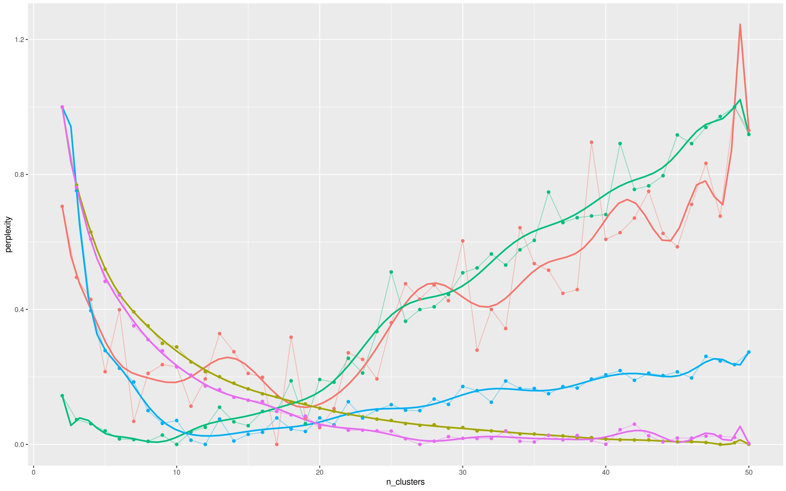

# Лабораторная работа №4 (Тематическое моделирование)

## Синопсис лекции

**Тематическое моделирование** - метод автоматической обработки коллекции текстовых документов путем их кластеризации по темам (topics), затрагиваемым в каждом документе.  
**LDA** - метод построения статистической модели текстовых документов путем внесения скрытого (unobserved) множества абстрактных объектов - тем (topics), порождающих документы коллекции.  
**CTM** - метод построения статистической модели текстовых документов, являющийся расширением `LDA` и основанный на введении дополнительного набора латентных переменных, которые соответствуют укрупненным документам (aggregated documents).  
**Gibbs sampling** - метод формирования выборки элементов из заданного набора с использованием условных вероятностей для аппроксимации сложных распределений нескольких случайных переменных.  
**Perplexity** - метрика, отражающая соответствие вероятностной модели некоторму набору текстовых данных.  
**r-squared** - метрика, отражающая соответствие модели некоторому набору числовых данных.  

## Задание

1. С использованием полученной в результате выполнения [третьей лабораторной работы](/tasks/task-03) матрицы "термин-документ" (term-document matrix) осуществить эксперименты с любой существующей моделью тематического моделирования документов (например, `LDA` или `CTM`). Допускается использовать библиотечные реализации. В каждом эксперименте необходимо задавать различное количество кластеров (для модели `LDA` рекомендуемое количество - от 2 до 50, для возможности получения дополнительных баллов по данному пункту рекомендуется проверить все значения в данном диапазоне при выборе модели `LDA`; для модели `CTM` вследствие более высокой вычислительной сложности рекомендуется реализовать эксперименты с 12 значениями в качестве количества тем с интервалом в 4 начиная с 2: 2, 6, 10, 14 и т.д). Помимо всего прочего, в одном из экспериментов количество кластеров должно быть задано равным количеству классов документов в выбранном датасете. Для каждого эксперимента зафиксировать:
    * топ-10 ключевых слов для каждой темы;
    * `perplexity` полученной модели на тестовой выборке (потребуется использовать реализацию алгоритма для построения матрицы "термин-документ", разработанную при выполнении предыдущей лабораторной работе);
    * вероятность принадлежности документов обучающей выборки к той или иной теме, а также документы для каждой темы, у которых данная вероятность наиболее высока.
1. После выполнения экспериментов построить график изменения `perplexity` в зависимости от количества тем, построить полиномиальную аппроксимацию полученного графика, количество элементов полинома выбрать с использованием метрики `r-squared`. Для получения бонусных баллов по данному пункту необходимо выполнить по 5 экспериментов для каждого количества тем, на графике требуется привести усредненные значения.
1. На основе собранных экспериментальных данных сформулировать вывод о том, какая модель работает более эффективно на выбранном датасете, а также какое количество тем является оптимальным в соответствии с имеющимися текстовыми данными. Для получения дополнительных баллов по данному пункту требуется повторить предыдущие шаги для нескольких значений количества итераций, реализуемых в процессе обучения, сформулировать вывод о том, какое количество итераций является оптимальным.
