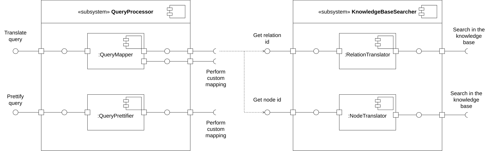

# Лабораторная работа №6 (Сервис аннотации текста)

## Синопсис лекции

**Inference** - процесс использования модели машинного обучения, заключающийся в предоставлении обученной и развернутой модели исходных данных и получения сгенерированных результатов.  
**Docker** - система виртуализации вычислительных ресурсов, позволяющая создавать универсальные образы (container images) сервисов, включающие все необходимые зависимости, изолирующие сервисы друг от друга и запускаемые с использованием стандартизованного `cli`.  
**UML** - общепринятый язык визуального моделирования программных систем, позволяющий описывать различные аспекты системы - с точки зрения архитектуры, алгоритма работы, сценариев использования и т.д.  
**REST** - подход к разработке интерфейсов программных систем, взаимодействующих при помощи протокола `HTTP`. При данном подходе к разработке интерфейсов программных систем обмен информацией осуществляется с использованием `HTTP`-запросов, содержащих информацию о транзакции, которую необходимо выполнить адресату.  
**RPC** - подход к разработке интерфейсов программных систем, взаимодействующих путем инициирования некоторой системой процесса выполнения функции, происходящего в другой системе. При данном подходе к разработке интерфейсов программных систем обмен информацией осуществляется с использованием запросов, содержащих сигнатуру вызываемой функции и значения передаваемых параметров.  
**GraphQL** - технология разработки интерфейсов программных систем, являющаяся развитием подхода `REST` и характеризующая более высокой гибкостью интерфейса, а также большим контролем над структурой и содержанием передаваемых запросов с точки зрения клиента.  

## Задание

1. Реализовать модуль обработки текста, основынный на модели, сформированной в результате выполнения одной из предыдущих лабораторных работ: [второй](/tasks/task-02), [четвертой](/tasks/task-04) или [пятой](/tasks/task-05). Реализованный модуль должен принимать в качестве исходных данных произвольный текст, а в качестве результата выдавать (в зависимости от того, как модель была выбрана): 
    - текст с исправленными опечатками;
    - список тем, поддерживаемых моделью, с топ-10 ключевыми словами для каждой темы и вероятностями принадлежности переданного текста к каждой теме;
    - список классов датасета, с вероятностями принадлежности переданного текста к каждому классу.
1. На основе модуля, разработанного на предыдущем шаге, реализовать сервис обработки текста. Взаимодействие с разработанным сервисом должно происходить в соответствии с одним из методов реализации интерфейсов программных систем: 
    - `REST`;
    - `RPC` (рекомендуется использовать фреймворк `gRPC`);
    - улучшенный вариант подхода `REST` (рекомендуется использовать технологию `GraphQL`).
1. Разработанный сервис необходимо обернуть в `docker`-контейнер и продемонстрировать вызовы реализованного сервиса, работающего внутри контейнера.
1. Для получения бонусных баллов по данному заданию при реализации `API` сервиса необходимо предусмотреть возможность параметризации процесса работы модели, например:
    - для сервиса, исправляющего опечатки - реализовать возможность задания в запросе веса операций удаления, вставки, замены символов;
    - для сервиса, осуществляющего тематическое моделирование - добавить возможность задания количества ключевых слов, которые требуется вернуть для каждой темы (либо организовать извлечение ключевых слов путем отправки отдельного запроса, а при непосредственно обработке переданного текста возвращать только вектор вероятностей);
    - для сервиса, выполняющего классификацию - реализовать включение / отключение подсчета векторных представлений документов со взвешванием векторных представлений токенов по `tf-idf`.
1. Построить [диаграмму компонентов](https://www.uml-diagrams.org/component-diagrams.html) разработанного сервиса в соответствии со спецификацией `UML 2.5`.
